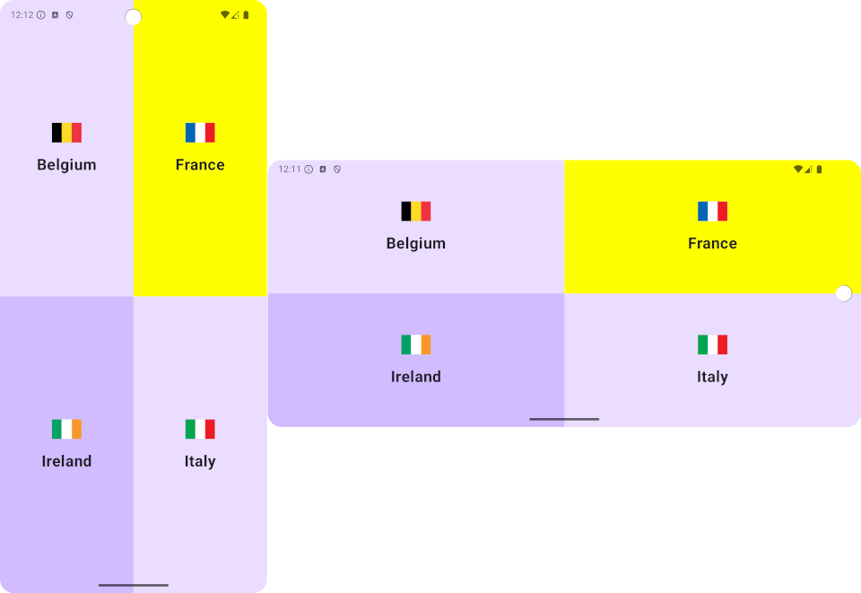
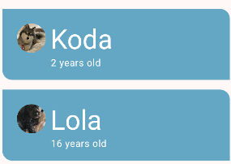
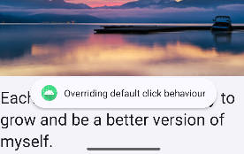

# Programming Portfolio - First Set of Exercises

*Please complete this document to confirm the work that has been done. You will also add your answers to the provided 
questions in the space provided*

Please replace ${\color{green}-- todo}$ with ${\color{blue}-- completed}$ once done.\
\
Include an appropriate screenshot from your application to confirm completion. Screenshots should be added to 
the /images folder in the top-level repo.\
\
Include the provided question for your exercise and your answer in the space provided.

---

### Happy Birthday ###

|   **First Part ${\color{green}-- todo}$**    |    **Extension ${\color{green}-- todo}$**    |
|:--------------------------------------------:|:--------------------------------------------:|
|  |  |

#### Question ####
> Android allows for bitmaps to be a drawable resource. Which file formats does Android
> support for these drawables. Is there a recommended format. 
>
> In addition – the Birthday example asked you to use the qualifier nodpi. What is the purpose of this qualifier. 
> What other qualifiers could be used?
> 
> You may have noticed that rotating the device with the Birthday example results in a poor layout returned. Using your
> knowledge of qualifiers - amend the birthday example, such that a better (landscape) picture is returned when in 
> landscape orientation. An example is shown below. 
> 
>  
> 
> Make sure to add a final commit to your birthday branch with the amended code and include a screenshot in your answer.
> 

#### Answer ####
> *Please provide your answer in this space*
> 
> 
> 
> 

---
### Quadrants ###

|    **First Part ${\color{green}-- todo}$**    |    **Extension ${\color{green}-- todo}$**     |
|:---------------------------------------------:|:---------------------------------------------:|
|  |  |

#### Question ####
> Composables have a modifier property. One property of a modifier is a clickable action. In the 
> screenshot below, individual quadrants have been modified such that they are:
> - clickable
> - clicking a quadrant will change its colour to YELLOW, a 2nd click will revert it back
> - orientation changes keep the YELLOW colour
> 
> NOTE that more than one QUADRANT can be YELLOW at a time
>
>  
>  
> Include in your answer what has to be changed to make this possible. You should make reference 
> to terminology being used in the Android documentation. 
> 
> Please add as a commit to the Quadrants branch a working example.
> 

#### Answer ####
> *Please provide your answer in this space*
> 
> 
> 
> 

---

### Woof ###

| **First Part ${\color{green}-- todo}$**  |  **Extension ${\color{green}-- todo}$**  |
|:----------------------------------------:|:----------------------------------------:|
|  |  |

#### Question ####
> Using the layout inspector tool, demonstrate through the use of a screenshot what the
> colour values used by the Card composable are.
> 
> Having seen what these values are, without changing the theme, how can the colour values of
> a card can be changed programmatically such that the resulting Woof example will have
> different colours. Commit this as a final change to the WOOF branch and include a 
> screenshot similar to. (Note your colour choices are up to you.)
> 
> 
>  
>  

#### Answer ####
> *Please provide your answer in this space*
> 
> 
> 
> 

---

### Affirmations ###

|     **First Part ${\color{green}-- todo}$**     |     **Extension ${\color{green}-- todo}$**      |
|:-----------------------------------------------:|:-----------------------------------------------:|
|  |  |

#### Question ####
> Affirmations asked for a Dialogue Composable to be used.  
>
> Please explain in more detail what are is the significance of its constructor 
> values (i.e. the parameters that you can pass to it when it created). 
> (Hint: refer to the API documentation) 
>
> https://developer.android.com/reference/kotlin/androidx/compose/ui/window/package-summary#Dialog
> 
> If you wanted to only allow the dialog to be removed when clicked directly 
> on – how would this be done. 
>
> Demonstrate this by adding a final commit to your code that will only allow 
> the removal of the dialog when clicked on. 
> 
> Include a new screenshot that pops up a new Toast to show this event happening.
> 
> > 
> 

#### Answer ####
> *Please provide your answer in this space*
> 
> 
> 
> 

---

